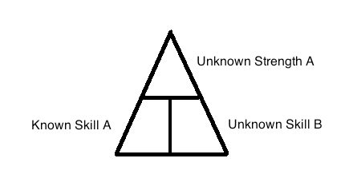

# You Need to Know Your Strengths and Weaknesses

After my first article on advice, I began to write up some of the things I've learned in my own process away from confusion and towards clarity. But then, a question posed itself to me: what would it take for someone to not feel lost? Perhaps it is different for each person. But in a general sense the basic structure seems to be the same: in order to find a new direction you need to figure out what strengths you have and how to leverage those in a different way from what you are used to doing.

## Advice About Strengths

One of the first pieces of advice that I got early on in this particular journey was that I needed to focus on my strengths. But I had no idea what it meant. I didn't even know my strengths. I was a pretty good programmer. Not the best, not the worst. Honestly, it was really the only thing I ever felt I did pretty well in my life. So while that piece of advice wasn't bad, it wasn't especially helpful at the time.

At some point a little later on I went and took the StrengthsFinder test, and got as my five strengths: Empathy, Intellection, Connectedness, Input, Adaptability. That seemed accurate enough, but I had no idea what to do with it. It would be years before I was able to make sense of that. Even after learning some of my strengths, it wasn't clear what to make of it, or what to do with it. 

I remember years ago taking the MBTI and getting INFP as the result. Which seemed right, but I didn't know what to do with it. I was idealistic, yes, but trying to translate that into the business world seemed like an impossibility. And I sure didn't connect to the career suggestions for INFPs. I wasn't an artist. I wasn't going to be a therapist. I wasn't a teacher. I wasn't a writer. I was in the health-care industry, which did feed a certain amount of my innate values. But overall, the MBTI didn't seem to be much help.

## Skills are Concrete, but Strengths Are Abstract

One of the things I didn't fully understand was that programming isn't a strength. It's a skill. Skills are situated in a concrete context, whereas strengths are abstracted from any particular environment. A few years later I began to really study the intricacies of personality traits and personality types, and I discovered that strengths are abstractions, and you have to do the work to fill in the blanks. By themselves, without some serious self-analysis, you won't be able to connect your strengths to picking up a new skill.

Part of the reason strengths are abstract to us is because we use our strengths without thinking about them. Our strengths are like axioms. They are the assumptions you bring to your career. Without them you wouldn't have even gotten into your career. But there is a strength or multiple strengths that you have that you aren't fully leveraging, where you can find new skills. There is immense potential in those strengths if you can make the time to identify them. It's the part of you that if you really pressed the pedal to the medal, your strengths could take you further and faster than you have been going.

## Your Habits of Attention Have Already Determined Your Strengths

The question is how to find a new direction. But you've already been choosing your direction, in a general way. You've already been honing your strengths. It's the habitual way in which you pay attention. Your soul may be infinite, but your attention span is not. Your finite attention span already has its habits. You like to work with your hands. Or you love languages and you love expressing yourself. Something general enough that can be applied across different skills.

And because you are used to paying attention in certain ways, the ways in which you do not pay attention end up making up your weaknesses. We have a finite attention span, and there's a tradeoff. That's one of the things I didn't understand when I first got my results from StrengthsFinder. Strengths imply weaknesses. When it comes to attention, you can't have your cake and eat it too. You can't be strong in everything.

Some habits of attention we find enjoyable, and others we find disagreeable. Maybe we hate the process of paying bills. Or maybe we love being organized.

## Making Strengths Concrete By Finding New Skills

What does it mean to make a strength concrete? It's to realize that your abstract strength applies to a new situation you haven't considered before. Focusing your strength on something different is like choosing a college major in mid-life. You've already specialized to a certain extent, and you would like to specialize in something else, possibly. Now, as we know from scientific studies, skills aren't transferable. You can't study chess and become a better programmer. But habits of attention are transferable. If we enjoy paying attention in a certain way to task A, and task B requires the same habit of attention, we may not be good at it yet, but we will enjoy the process of getting good at it. That's why if you can view a strength as a habit of attention, you can take that pattern and apply it to a totally different field. Recognizing a new application of an old strength allows you to breathe new life into the old you, without sacrificing all the hard work you've put in, in the past.

## Your Habitual Strengths And Your Choice of New Skills Give You Direction

Your innate strengths and mastered weaknesses narrow down your range of options. That, by itself, makes you less lost, even if you don't feel it yet.

One of my strengths is that I'm very close to my own emotions. I don't handle them well, and I don't always pay attention to what they're saying, but I'm a feeler and I know exactly how I'm feeling. But there are times when it gets too intense and gets more confusing than clarifying. I had to find a better way of understanding my emotions, because for me, without that, I was just going to keep getting stuck in them. That closeness is an innate strength that I wasn't leveraging. I needed to learn how to navigate my emotions with more wisdom.

Recently, I took another personality type test called StandOut 2.0. My top two results were "Teacher" and "Provider." 
