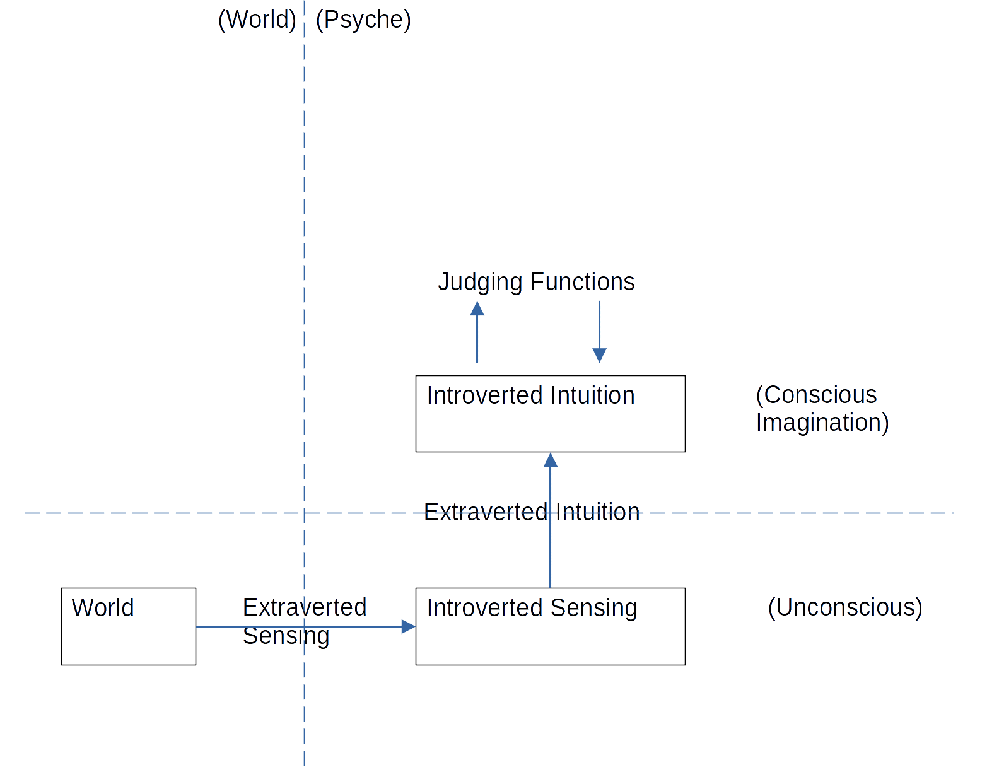

First, we receive sensations from the world. Our mind takes the fluctuating data from the world and transforms it into something we can perceive. For instance, we don’t hear everything that could be heard, but only hear within a specific range of frequencies. As such, our mind represents the raw data of the world in a form that our unconscious mind can deal with.

Second, when receiving this first level of representation, it gets collated into Introverted Sensing, which is where our mind can deal with all of these first level representations. The forms of cars, dogs, trees, end up there, as well as emotions and other things we might experience with an inner sense.

Third, our conscious mind receives information bubbling up from our inner sense and the input coming from the world. This second source of knowledge is called Extraverted Intuition, which turns the first-level representations into second-level representation we can consciously manipulate inside of our imagination.

Finally, the place where we store and manipulate these second level representations is called Introverted Intuition.

From here, our judging functions get involved, as they can only process the abstractions within Introverted Intuition and generate new abstractions.
